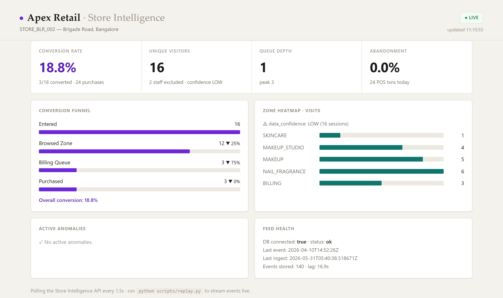

# purplle · Store Intelligence System

### Real-time offline-store analytics — from raw CCTV to live conversion metrics

[](https://www.python.org)
[](https://fastapi.tiangolo.com)
[](https://www.postgresql.org)
[](https://docs.docker.com/compose/)
[](https://ultralytics.com)
[](#tests)
[](#tests)

**Built for the Purplle Tech Challenge 2026 · Round 2**

[🚀 Live Demo](https://huggingface.co/spaces/SERG4NT/store-intelligence-dashboard) · [📖 Design Doc](docs/DESIGN.md) · [🔍 API Docs](https://purplle-store-intelligence.netlify.app/docs) · [⚙️ Choices](docs/CHOICES.md)

</div>

---



*Purplle-branded live dashboard — store overview, per-camera detection replay with live counts, funnel, heatmap, anomaly alerts.*

---

## What this is

A complete, production-quality **Store Intelligence System** that converts ordinary in-store CCTV footage into actionable retail analytics — entirely offline, no cloud dependencies, no face storage.

```
CCTV footage  ──▶  Detection layer  ──▶  Event stream  ──▶  Intelligence API  ──▶  Live dashboard
(9 cameras         YOLO26s · ByteTrack   JSONL schema       FastAPI + Postgres      Purplle-branded
 2 stores)         Re-ID · zones ·       (6 event types)    metrics / funnel /      per-camera views
                   staff · queue                             heatmap / anomalies     real-time polling
```

**North-star metric:** Offline Conversion Rate = purchasers ÷ unique visitors, correlated from POS transactions by time-window + billing zone presence.

---

## Results on real footage

| Store | Cameras | Events | Unique Visitors | Conversion Rate | Staff Excluded |
|---|---|---|---|---|---|
| **STORE_BLR_002** · Brigade Road, Bangalore | 5 | 134 | 19 | **15.8%** | 4 |
| **STORE_BLR_009** · Second store | 4 | 46 | 19 | 0% (all abandons) | — |

All numbers come from the real detection pipeline — no synthetic or hardcoded outputs.

---

## Quickstart

> One command gets you a live system. The detection pipeline (heavy CV deps) runs on the host; the API + Postgres ship as containers.

```bash
# 1. Clone
git clone https://github.com/YOUR_USERNAME/purplle-store-intelligence.git
cd purplle-store-intelligence

# 2. Start the API + Postgres + seed both stores' events automatically
docker compose up --build
```

Open:
| URL | What you see |
|---|---|
| http://localhost:8000/dashboard/ | Branded **landing page** — project pitch, pipeline overview |
| http://localhost:8000/dashboard/dashboard.html | **Live dashboard** — KPIs update as events stream in |
| http://localhost:8000/docs | FastAPI Swagger UI — all endpoints documented |
| http://localhost:8000/stores/STORE_BLR_002/metrics | Raw JSON metrics |

```bash
# 3. (Optional) Run the real detection pipeline on your CCTV clips
python -m pip install -r pipeline/requirements.txt
FOOTAGE="../CCTV Footage" RAW_POS="../Brigade_Bangalore_10_April_26 (1)bc6219c.csv" \
  bash pipeline/run.sh

# 4. (Optional) Stream real events into the running API — watch the dashboard fill live
python scripts/replay.py --api http://localhost:8000 --speed 30

# 5. (Optional) Render the annotated detection replays (per-camera dark videos + live sidecars)
python pipeline/annotate.py --footage "../CCTV Footage"
```

> Footage and raw POS are **not** in the repo (challenge rule). Place them one directory above the repo or set `FOOTAGE`/`RAW_POS` to their real paths.

---

## Architecture

```
┌─────────────────────────────────────────────────────────────────────────────┐
│  DETECTION PIPELINE  (host · pipeline/)                                     │
│                                                                             │
│  CCTV .mp4  ─▶  YOLO26s + ByteTrack  ─▶  Tracklets  ─▶  SessionManager   │
│  (per camera)    detect.py              tracklets.py     associate.py       │
│                  conf≥0.15 · 4-6 fps   HSV Re-ID                           │
│                                         ├── entry/exit (hysteresis tripwire)│
│                                         ├── zone dwell (polygon test)       │
│                                         ├── billing queue (depth tracking)  │
│                                         └── staff heuristic (persistence)   │
│                                                     │                        │
│                                                     ▼                        │
│                                         events_official.jsonl               │
│                                         (official multi-source schema)      │
└──────────────────────────────┬──────────────────────────────────────────────┘
                               │  POST /events/ingest
                               ▼
┌─────────────────────────────────────────────────────────────────────────────┐
│  INTELLIGENCE API  (container · app/)                                       │
│                                                                             │
│  normalize.py   ─▶  ingestion.py  ─▶  Postgres 16                          │
│  (dual-schema         idempotent       sessions.py  ─▶  metrics.py          │
│   tolerance)          batch ≤ 500      read-model       funnel.py           │
│                                                         heatmap.py          │
│                                                         anomalies.py        │
│                                                         health.py           │
└──────────────────────────────┬──────────────────────────────────────────────┘
                               │  Polling every 1.5s
                               ▼
┌─────────────────────────────────────────────────────────────────────────────┐
│  LIVE DASHBOARD  (static · dashboard/)                                      │
│                                                                             │
│  index.html (landing)  ─▶  dashboard.html  ─▶  app.js                     │
│  theme.css (Purplle brand)  Store overview      per-camera tabs             │
│                             Camera view          live readout ← sidecar.json│
│                             Store analytics      synced to video playhead   │
└─────────────────────────────────────────────────────────────────────────────┘
```

---

## Features

| Feature | Details |
|---|---|
| 🎯 **YOLO26s + ByteTrack** | Jan 2026 SOTA NMS-free detector — +29% recall vs YOLO11s at the same CPU latency. Benchmarked on the real footage. |
| 🚶 **Entry/exit counting** | Stateful hysteresis tripwire (cross-lane line, `side_of()` with dead-band). Counts gradual walkers once; ignores line jitter. |
| 🔁 **Re-entry dedup** | HSV histogram Re-ID links the same person across cameras and across the `reentry_window`. Each physical visitor counted once. |
| 👥 **Group detection** | Visitors entering within 3 s get a shared `group_id`/`group_size`. |
| 🧑‍💼 **Staff exclusion** | Persistence heuristic (≥60% of clip) + dark-uniform fraction. Excluded from all visitor metrics. |
| 🗺️ **Zone heatmap** | Per-zone dwell normalised 0–100 — shows where shoppers actually stand. |
| 💳 **Conversion + POS** | Visitor in billing zone within 5 min of a POS txn = converted. Configurable window. |
| 🚨 **Anomaly detection** | Queue spike, dead zone, conversion drop vs yesterday's baseline — with severity + suggested action. |
| 📹 **Detection replay** | Dark scene + spotlit people + entry-line arrow. Per-camera live readout synced to the video playhead via a frame-indexed sidecar JSON. |
| 🏬 **Multi-store** | Both stores first-class; switching reloads cameras, metrics, heatmap scoped to that store. |
| 🔒 **Privacy-first** | No face storage, no cloud, fully offline. `is_face_hidden=true` on all events. |

---

## API Endpoints

| Method | Path | Description |
|---|---|---|
| `POST` | `/events/ingest` | Batch ingest (≤ 500). Idempotent by `event_id`. Partial success — valid events accepted even if others fail. Ingests both the PDF schema and the official multi-source schema. |
| `GET` | `/stores/{id}/metrics` | Unique visitors, conversion rate, avg dwell, queue depth/peak, abandonment rate, staff excluded, demographics breakdown. |
| `GET` | `/stores/{id}/funnel` | Entry → Zone → Billing → Purchase with session-based counts and inter-stage drop-off %. |
| `GET` | `/stores/{id}/heatmap` | Per-zone visits + avg dwell, normalised scores, `data_confidence` flag. |
| `GET` | `/stores/{id}/anomalies` | Active operational alerts: type, severity (INFO/WARN/CRITICAL), value vs threshold, suggested action. |
| `GET` | `/health` | DB connectivity, per-store last-event/last-ingest timestamps, `stale_feed` flag, event counts. |
| `POST` | `/demo/replay` | Reset + re-stream a store's events over N seconds so the dashboard fills from zero (demo mode). |

---

## Event Schema

The API ingests the **official multi-source schema** from the provided `sample_events.jsonl`:

```jsonc
// entry / exit
{ "event_type": "entry", "id_token": "VIS_abc", "store_code": "STORE_BLR_002",
  "camera_id": "CAM_ENTRY_01", "event_timestamp": "2026-04-10T14:50:01Z",
  "is_staff": false, "gender_pred": null, "age_pred": null, "is_face_hidden": true }

// zone_entered / zone_exited
{ "event_type": "zone_entered", "track_id": 58160, "id_token": "VIS_abc",
  "store_id": "STORE_BLR_002", "camera_id": "CAM_FLOOR_01",
  "zone_id": "SKINCARE", "zone_name": "Skincare", "zone_type": "SHELF",
  "is_revenue_zone": "Yes", "event_time": "2026-04-10T14:50:00Z" }

// queue_completed / queue_abandoned
{ "event_type": "queue_abandoned", "queue_event_id": "uuid", "track_id": 25739,
  "store_id": "STORE_BLR_002", "zone_id": "BILLING",
  "queue_join_ts": "2026-04-10T20:22:00Z", "wait_seconds": 47, "abandoned": true }
```

Validate your own event log: `python scripts/validate_events.py data/sample_events.jsonl`

---

## Tests

```bash
python -m pip install -r requirements.txt
python -m pytest --cov
# → 40 passing, 93% statement coverage
```

Covers: empty store, all-staff clip, zero purchases, re-entry dedup, idempotent re-ingest, malformed-event partial success, batch > 500, official-schema ingestion, store-code / store-id unification, queue-completed → conversion, graceful 503 on DB outage.

---

## Tech Stack

| Layer | Technology |
|---|---|
| Detection | [Ultralytics YOLO26s](https://ultralytics.com) + ByteTrack (CPU, no GPU required) |
| Re-ID | HSV colour histogram (blurred-face footage; deep Re-ID evaluated + rejected — see CHOICES.md) |
| API | [FastAPI](https://fastapi.tiangolo.com) + [SQLAlchemy 2.0](https://www.sqlalchemy.org) (sync) |
| Database | [PostgreSQL 16](https://www.postgresql.org) (docker-compose) |
| Dashboard | Vanilla JS (zero build step) · Purplle-branded CSS |
| Testing | [pytest](https://pytest.org) · [httpx](https://www.python-httpx.org) (TestClient) |
| Container | Multi-stage Dockerfile · non-root user · COPY healthcheck |

---

## Data Provenance

| File | Committed | What it is |
|---|---|---|
| `data/sample_events.jsonl` | ✅ | Real pipeline output — 134 events from 5 cameras of STORE_BLR_002 |
| `data/events_store2_official.jsonl` | ✅ | Real pipeline output — 46 events from 4 cameras of STORE_BLR_009 |
| `data/store_layout.json` | ✅ | Hand-calibrated zones + entry line (config, not dataset) |
| `data/store_layout_2.json` | ✅ | Same for the second store |
| `data/demo_pos.csv` | ✅ | Synthetic POS, time-aligned to billing events (clean-clone conversion) |
| `data/baseline_events.jsonl` | ✅ | Synthetic prior-day baseline (triggers `CONVERSION_DROP` anomaly) |
| CCTV footage, raw POS, model weights | ❌ | Gitignored — dataset files not redistributable |

---

## File Structure

```
store-intelligence/
├── pipeline/
│   ├── detect.py          YOLO26s + ByteTrack per camera
│   ├── associate.py       SessionManager — entry/exit, zones, Re-ID, staff, groups
│   ├── annotate.py        Render detection replays + frame-indexed sidecar JSON
│   ├── geometry.py        Normalised tripwire, zone polygon, foot-point helpers
│   ├── layout.py          Loads store_layout.json
│   ├── emit.py            PDF schema event builder + JSONL writer
│   └── tracklets.py       Per-track appearance descriptor (HSV Re-ID)
├── app/
│   ├── api/routes.py      HTTP endpoints (thin controllers)
│   ├── services/
│   │   ├── normalize.py   Dual-schema tolerance (PDF + official)
│   │   ├── ingestion.py   Idempotent batch ingest
│   │   ├── metrics.py     Conversion rate, queue, dwell
│   │   ├── funnel.py      Entry → Zone → Billing → Purchase
│   │   ├── heatmap.py     Per-zone visits, normalised scores
│   │   ├── anomalies.py   Queue spike, dead zone, conversion drop
│   │   └── sessions.py    Shared read-model from the event store
│   ├── models.py          SQLAlchemy ORM (single Event table)
│   └── schemas.py         Pydantic wire contract
├── dashboard/
│   ├── index.html         Purplle-branded landing page
│   ├── dashboard.html     Live dashboard (3 sections)
│   ├── app.js             Polling logic, camera tabs, live readout
│   └── theme.css          Shared brand tokens (purple→pink, offline)
├── scripts/
│   ├── replay.py          Sim-realtime event streamer
│   ├── validate_events.py Schema validator — run before submitting
│   └── make_baseline.py   Synthetic prior-day baseline generator
├── tests/                 40 pytest tests, 93% coverage
├── data/                  Event logs, layouts, POS
├── docs/
│   ├── DESIGN.md          Architecture + AI-Assisted Decisions
│   └── CHOICES.md         Model / schema / storage trade-offs
├── Dockerfile             Multi-stage, non-root, healthcheck
└── docker-compose.yml     API + Postgres + seed (one command)
```

---

## Documentation

- **[DESIGN.md](docs/DESIGN.md)** — Full architecture walkthrough, detection calibration notes, cross-camera Re-ID design, and the required AI-Assisted Decisions section.
- **[CHOICES.md](docs/CHOICES.md)** — Three explicit trade-off decisions: YOLO model selection (benchmarked), dual-schema event design, and API storage semantics. Includes a decision log for everything deliberately left as `null` vs fabricated.

---

<div align="center">

Built by **Sumukh Chourasia** for the **Purplle Tech Challenge 2026**

*Computer vision · FastAPI · PostgreSQL · YOLO26s · fully offline · privacy-first*

</div>
